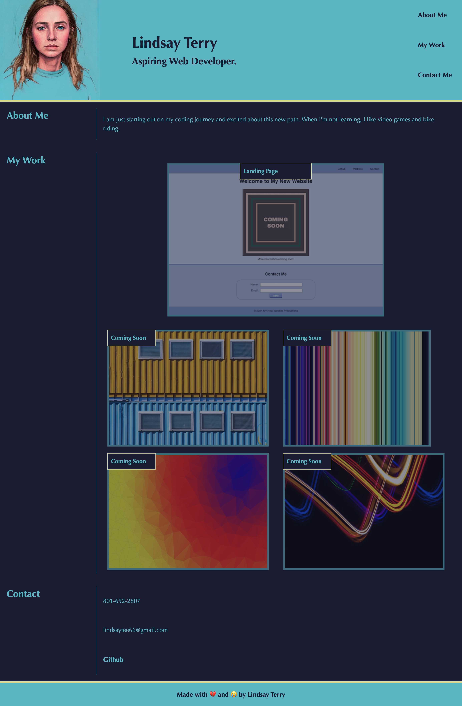

# <Lindsay-Terry-Portfolio>

## Description

This project serves as a portfolio to provide potential employers examples of my work as well as contact information for how to reach me.  This project was the largest "from scratch" application I have done by myself to date and provided me with several challenges and opportunities to learn.  The first drafts were rough: pictures too large, not lining up, and not responding the way I had anticipated them to with the flex properties I was assigning.  I quickly realized that images doubling as a link provided another layer of complexity to the flex properties, because nested beneath an anchor element, they were no longer direct descendents of the container I had created as a plan to manipulate all the images.  I still needed that contianer, however, to keep all the images together, so I created individual "containers" for each image as a workaround and was able to control their movement a little better.  Another challenge was positioning the title text over each image.  Simple in theory, right?  A little tougher in practice for the first time writing all the code myself.  My solution was to take a step back from being absorbed in flex properties and reference an even more basic CSS positioning tool: absolute and relative.  I had gone down a rabbit hole with negative margins all over the place to drag the text over the image where I wanted.  Finally, great success, each image had a title text over it.  I moved along, pleased with myself, until I started to delve into what would be my next challenge in this project: responsiveness.  As I shrunk the webpage, my images shrunk, I used media queries for my nav bar to make it easier to use on a smaller screen, but my meticulously moved title texts were nowhere to be seen.  

- What was your motivation?
- Why did you build this project? (Note: the answer is not "Because it was a homework assignment.")
- What problem does it solve?
- What did you learn?

## Installation

N/A

## Usage

This portfolio proves a short description to get to know a little about me, as well as previews of my work.  The top picture, larger than the others, serves as a preview and a link to my first project.  Hovering over the image, the user will notice a border and opacity change, and clicking on the image will send the user directly to the deployed application.  The coming soon projects are not yet linked to projects, so clicking them will return the user to the top of the page.

To add a screenshot, create an `assets/images` folder in your repository and upload your screenshot to it. Then, using the relative file path, add it to your README using the following syntax:

## Credits

Image by <a href="https://pixabay.com/users/valterm-24820004/?utm_source=link-attribution&utm_medium=referral&utm_campaign=image&utm_content=8622786">Valter</a> from <a href="https://pixabay.com//?utm_source=link-attribution&utm_medium=referral&utm_campaign=image&utm_content=8622786">Pixabay</a> - Shipping container image

Image by <a href="https://pixabay.com/users/wavegenerics-29440244/?utm_source=link-attribution&utm_medium=referral&utm_campaign=image&utm_content=7854576">WaveGenerics</a> from <a href="https://pixabay.com//?utm_source=link-attribution&utm_medium=referral&utm_campaign=image&utm_content=7854576">Pixabay</a> - Vertical lines image

Image by <a href="https://pixabay.com/users/heavenbeat-962982/?utm_source=link-attribution&utm_medium=referral&utm_campaign=image&utm_content=1036325">Ki yong Ban</a> from <a href="https://pixabay.com//?utm_source=link-attribution&utm_medium=referral&utm_campaign=image&utm_content=1036325">Pixabay</a> - Triangle gradient image

Image by <a href="https://pixabay.com/users/toush-469535/?utm_source=link-attribution&utm_medium=referral&utm_campaign=image&utm_content=1232379">Luc SCHROER</a> from <a href="https://pixabay.com//?utm_source=link-attribution&utm_medium=referral&utm_campaign=image&utm_content=1232379">Pixabay</a> - Neon wavy lines image

## License

N/A

